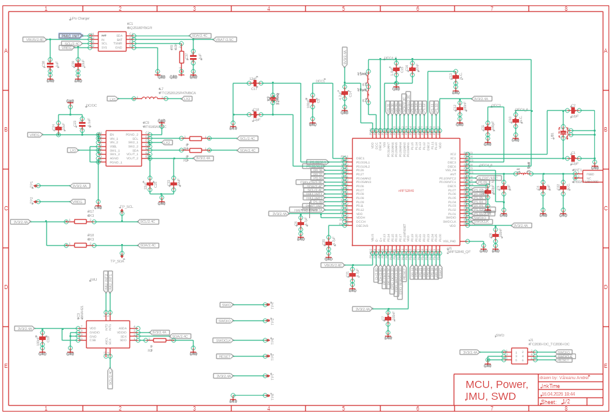
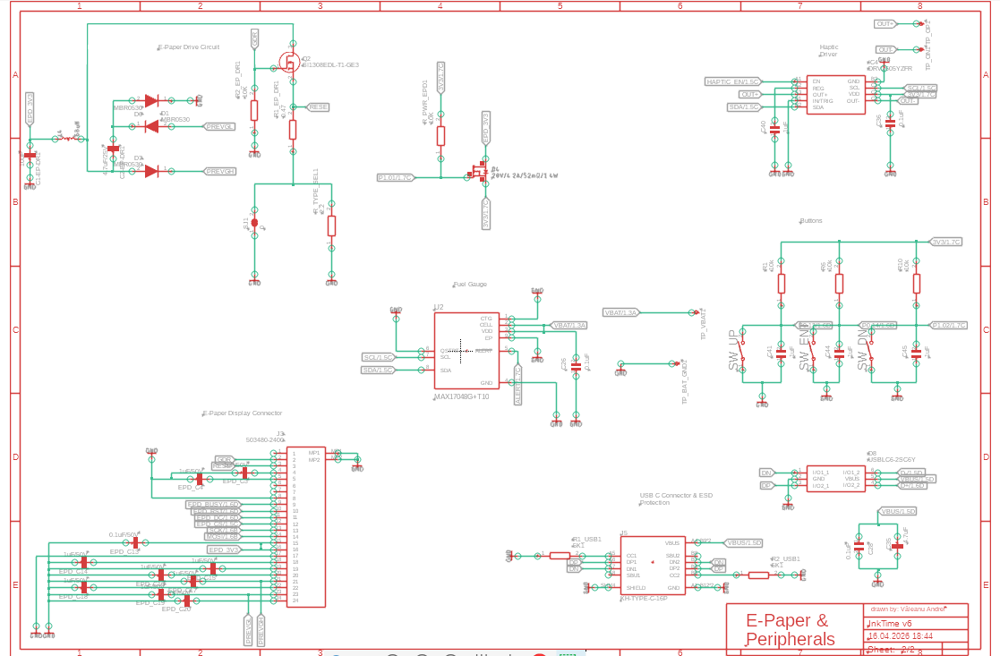
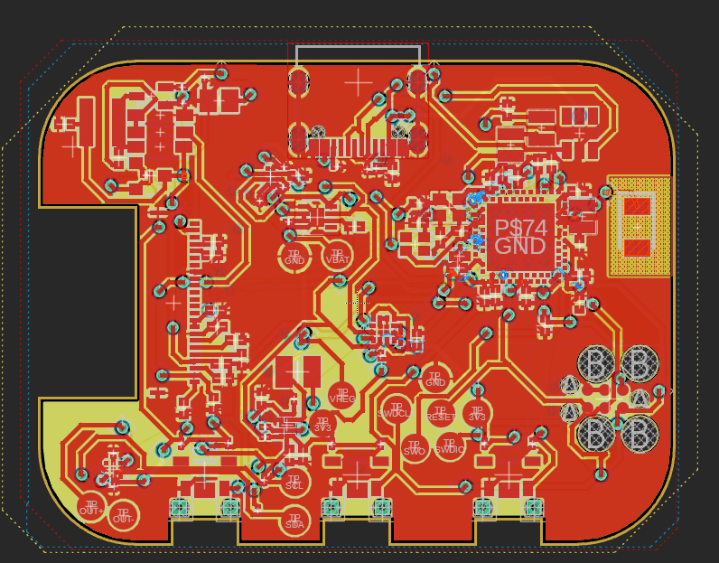
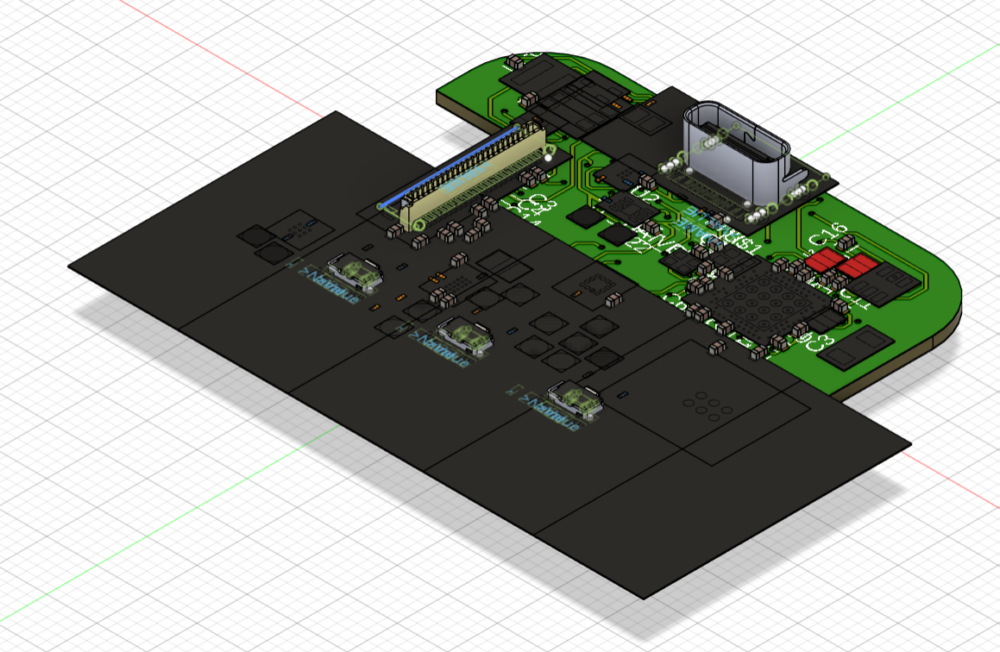
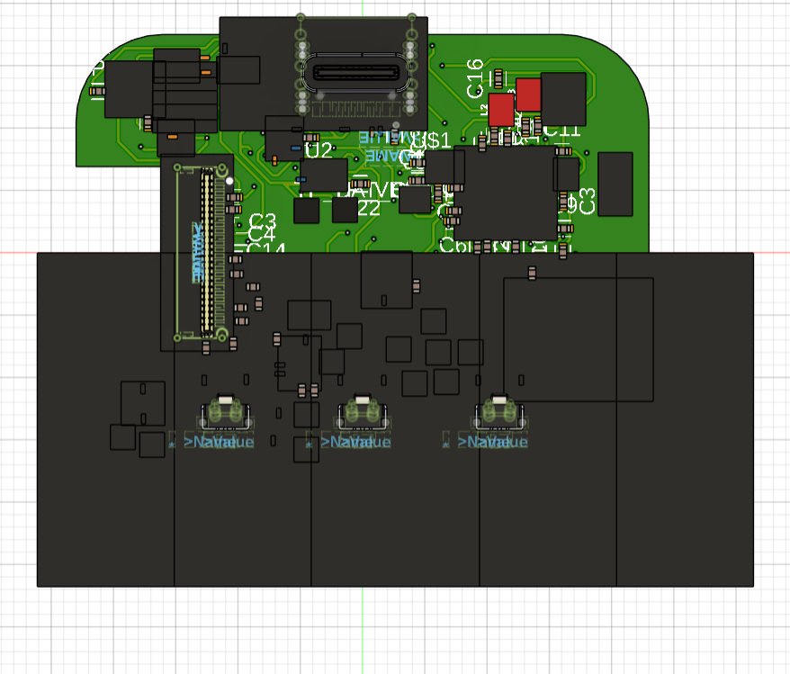
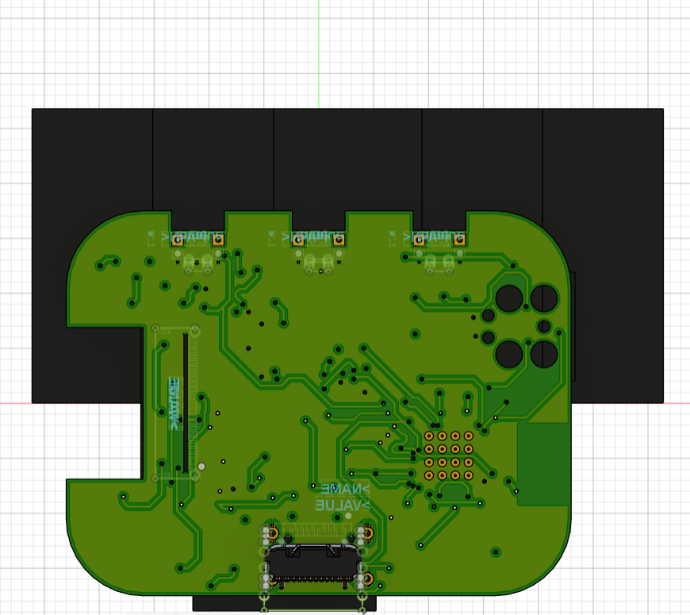
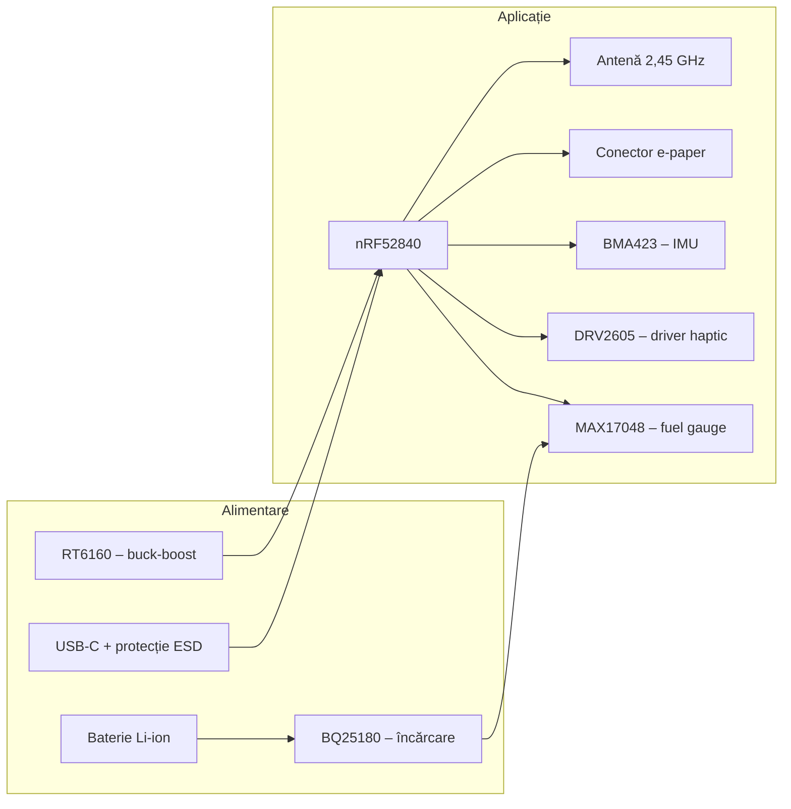

# InkTime – Proiect TSC 2026

## Rezumat

Acest depozit conține schematica nativă, placa de circuit imprimat, livrabilele de manufacturare, materialele mecanice parțiale și documentația vizuală pentru dispozitivul **InkTime**, aliniate structurii cerute în ghidul de proiect de pe [OCW – Proiect 2026](https://ocw.cs.pub.ro/courses/tsc/proiect2026).

## Galerie imagini

Capturile de mai jos sunt versiunile din directorul `Images/` și se afișează direct în pagina README pe GitHub.

### Schematică (două zone)





### Placă de circuit imprimat



### Previzualizări 3D







## Conformitate cu structura de încărcare (OCW)

| Cerință OCW | Conținut în acest depozit |
|-------------|---------------------------|
| `Hardware/` – schematic `.sch` | `ProjectTSCEtapa1.sch` |
| `Hardware/` – placă `.brd` | `InkTime v6_PCB_Partea2.brd` |
| `Hardware/` – print schematic `.pdf` | `InkTime_Schematic.pdf` (compus din capturile din `Images/`) |
| `Manufacturing/` – `gerbers.zip` | `gerbers.zip` (vezi secțiunea *Gerber și export CAM*; include cupru/profil/găuri din `.brd` și, opțional, straturi complete din `fusion_export/`) |
| `Manufacturing/` – BOM `.bom` | `InkTime.bom` |
| `Manufacturing/` – Pick&Place `.cpl` | `InkTime.cpl` |
| `Mechanical/` – ansamblu 3D | `ProjectTSCEtapa1.f3z`, `InkTime_Case.f3z`, modele `.STEP` pentru componente, `InkTime v6_PCB_Partea2.3mf` (vezi secțiunea *Modelare 3D*) |
| `Images/` | Randări și capturi (PCB, schematic, previzualizări 3D) |
| `LICENSE`, `README.md` | Prezente |

### Fișierul `InkTime.fbrd` din `Hardware/`

`InkTime.fbrd` este **fișierul de referință** furnizat prin arhiva OCW pentru recomandări de amplasament mecanic; **nu** înlocuiește proiectul de placă editabil. Proiectul de placă livrat pentru evaluare este `InkTime v6_PCB_Partea2.brd`. Fișierul `InkTime.fbrd.brd`, care genera confuzie în review (nu corespundea unui flux clar schematic → placă), a fost **eliminat** din depozit.

## Structura directoarelor

- `Hardware/` – schematic, placă, PDF-ul schemei.
- `Manufacturing/` – `gerbers.zip`, `InkTime.bom`, `InkTime.cpl`, directorul `fusion_export/` pentru exportul CAM din Fusion (vezi mai jos).
- `Mechanical/` – proiecte Fusion (`.f3z`), model 3MF al PCB-ului, modele STEP pentru componente (ex.: conector USB-C, celulă baterie).
- `Images/` – capturi pentru documentație și pentru compunerea PDF-ului schemei.
- `tools/` – scriptul de generare a livrabilelor de manufacturare și a PDF-ului schemei.

## Gerber și export CAM (cerință OCW)

Conform [ghidului de proiect OCW](https://ocw.cs.pub.ro/courses/tsc/proiect2026), arhiva **`gerbers.zip`** trebuie să conțină setul de fișiere Gerber/Excellon folosit la producție (cupru pe toate straturile, mască, pastă, serigrafie, profil, găuri), generate de obicei prin **CAM Processor** din Fusion Electronics, cu fișierul de reguli DRC indicat la curs.

### Cum obții un `gerbers.zip` complet

1. În **Fusion Electronics**, deschide placa și rulează exportul Gerber/Drill conform [tutorialului OCW pentru Gerber](https://ocw.cs.pub.ro/courses/tsc/proiect2026) (meniul de generare CAM din documentația cursului).
2. Copiază **toate** fișierele rezultate (`.gbr`, `.gtl`, `.gbl`, `.gts`, `.gbs`, `.gtp`, `.gko`, `.drl` etc.) în directorul  
   **`Manufacturing/fusion_export/`** din acest depozit (poți păstra denumirile implicite ale Fusion).
3. Din rădăcina depozitului rulează:  
   `python tools/build_ocw_deliverables.py`  
   Scriptul construiește `gerbers.zip` astfel: **mai întâi** include tot ce se află în `fusion_export/`; **apoi** completează doar fișierele lipsă (ex.: straturi de cupru/profil/găuri) din parsarea XML a fișierului `.brd`, dacă Fusion nu a emis deja un fișier cu același nume. Astfel, după ce plasezi exportul CAM, arhiva reflectă **prioritar** setul oficial Fusion, aliniat cerințelor OCW.

Dacă `fusion_export/` este gol, arhiva conține doar livrabilele derivate automat din `.brd` (util pentru verificare rapidă, fără mască/pastă/silk explicite).

## Diagramă bloc (arhitectură hardware)



## Descriere hardware (rezumat funcțional)

Microcontrolerul principal **nRF52840** (U1) asigură procesarea, conectivitatea **Bluetooth Low Energy** prin pinul dedicat de RF către antena Johanson, interfața **USB** (D+/D−) pentru programare și alimentare de la port, un magistrală **I²C** comună pentru senzori și periferice (încărcător BQ25180, convertoare, MAX17048, BMA423, DRV2605), precum și un port **SPI** (semnalele `SCK` / `MOSI` și liniile de control) către conectorul **Molex 503480-2400** (J3) al afișajului e-paper. Lanțul de alimentare include încărcarea bateriei (IC1), monitorizarea celulei (U2) și reglarea tensiunii de sistem (IC9), conform schemei `ProjectTSCEtapa1.sch`.

## BOM orientativ (module principale)

Tabelul de mai jos indică **componente-reper**; pentru lista completă a pieselor și a footprint-urilor folosiți `Manufacturing/InkTime.bom` (regenerabil). Linkurile către JLCPCB folosesc căutarea după cod articol; datasheet-urile sunt la producător.

| Rol | Piesă (din schemă) | Căutare JLCPCB | Datasheet |
|-----|-------------------|----------------|-----------|
| MCU + radio BLE | nRF52840 (U1) | [Căutare „nRF52840”](https://jlcpcb.com/parts/componentSearch?searchTxt=nRF52840) | [Nordic Semiconductor](https://www.nordicsemi.com/products/nrf52840) |
| Încărcare baterie | BQ25180YBGR (IC1) | [Căutare „BQ25180”](https://jlcpcb.com/parts/componentSearch?searchTxt=BQ25180) | [Texas Instruments](https://www.ti.com/product/BQ25180) |
| Buck-boost | RT6160AWSC (IC9) | [Căutare „RT6160”](https://jlcpcb.com/parts/componentSearch?searchTxt=RT6160) | [Richtek](https://www.richtek.com/) |
| IMU | BMA423 (IC3) | [Căutare „BMA423”](https://jlcpcb.com/parts/componentSearch?searchTxt=BMA423) | [Bosch Sensortec](https://www.bosch-sensortec.com/media/datasheets/bst-bma423-ds000.pdf) |
| Fuel gauge | MAX17048G+T10 (U2) | [Căutare „MAX17048”](https://jlcpcb.com/parts/componentSearch?searchTxt=MAX17048) | [Analog Devices](https://www.analog.com/en/products/max17048.html) |
| Driver haptic | DRV2605YZFR (IC4) | [Căutare „DRV2605”](https://jlcpcb.com/parts/componentSearch?searchTxt=DRV2605) | [Texas Instruments](https://www.ti.com/product/DRV2605) |
| Protecție USB | USBLC6-2SC6Y (D8) | [Căutare „USBLC6”](https://jlcpcb.com/parts/componentSearch?searchTxt=USBLC6-2SC6Y) | [STMicroelectronics](https://www.st.com/en/protection-ics/usblc6-2sc6y.html) |
| Conector e-paper | 503480-2400 (J3) | [Căutare „503480-2400”](https://jlcpcb.com/parts/componentSearch?searchTxt=503480-2400) | [Molex – căutare serie](https://www.molex.com/molex/products/search?q=503480-2400) |

## Alocare funcțională a pinilor nRF52840 (U1)

Tabelul rezumă legături **esențiale** extrase din `ProjectTSCEtapa1.sch`; pentru decodarea completă a pad-urilor BGA consultați PDF-ul schemei și fișierul `.sch`.

| Funcțiune | Pin GPIO / dedicat (etichetă în schemă) | Observații |
|-----------|----------------------------------------|-------------|
| USB date | `D+`, `D−` | Stivă USB 2.0 integrată în nRF52840 |
| Alimentare USB | `VBUS` | Detecție / alimentare de la conector |
| Depanare SWD | `SWDIO`, `SWDCLK` | Programare și debug |
| Reset | `P0.18` (RESET) | Linie de reset a sistemului |
| RF antenă | `ANT` | Conexiune la rețeaua de adaptare și antenă 2,45 GHz |
| SPI e-paper – ceas | `P0.02` | Semnal `SCK` |
| SPI e-paper – date | `P0.03` | Semnal `MOSI` |
| E-paper – selecție | `P0.05` | `EPD_CS` |
| E-paper – control | `P0.15`, `P0.16`, `P0.17` | Respectiv `EPD_DC`, `EPD_RST`, `EPD_BUSY` |
| I²C periferice | `P0.06` (SDA), `P0.07` (SCL) | Magistrală partajată (încărcător, IMU, gauge, DRV2605 etc.) |
| Întreruperi IMU | `P0.08`, `P1.08` | `IMU_INT1`, `IMU_INT2` |
| Cristal HF | `XC1`, `XC2` | Oscilator 32 MHz pentru radio |

## Justificări tehnice și răspuns la observațiile din review

Secțiunea următoare documentează, în mod explicit, starea **ERC/DRC**, limitările la **modelarea 3D** și, pentru transparență, **via stitching** (ce apare concret în layout) versus **via fencing** (definiție de referință din documentație / curs).

### Schematică și ERC (Electrical Rule Check)

Schema electrică este **funcțional completă** în sensul fluxurilor de alimentare, de date și de interfețe prevăzute de tema InkTime. La rularea **ERC** în mediul Autodesk Fusion / Eagle, rezultatul curent este **0 erori** și **44 avertismente**.

În cadrul laboratorului a fost comunicat faptul că, pentru această temă, **ordinul de mărime a avertismentelor ERC** se situează în mod tipic în jurul valorii de **40** (alți colegi au raportat, de exemplu, **41** de avertismente). În evoluția propriului proiect, au fost înregistrate **43**, apoi **44** de avertismente, după ajustări minore de bibliotecă și de etichetare. Variația cu **una–două unități** față de media grupei se încadrează, din perspectivă inginerească, în **aceeași clasă de severitate**: majoritatea mesajelor sunt **neblocante** (ex.: atribute de catalog incomplete, recomandări de denumire, conexiuni marcate ca „not connected” acolo unde pachetul o permite, sau reguli conservative ale verificatorului). **Nu au fost ignorate erori ERC critice**; avertismentele rămân documentate pentru transparență și pot fi grupate pe categorii (alimentări, biblioteci online, NC) într-o iterație ulterioară de curățare a schemei, fără a altera topologia electrică aprobată.

### Placă (PCB) și DRC (Design Rule Check)

Verificarea **DRC** cu setul de reguli indicat în cadrul cursului raportează, în stadiul curent al plăcii, următoarele categorii (valorile reflectă ultima centralizare folosită în review):

| Categorie DRC | Număr de încălcări | Interpretare sumară |
|-----------------|-------------------:|------------------------|
| Overlap | 65 | Suprapuneri în principal între **pad-uri / pastile de pastă / zone fine** la densitate mare (capsule 0201, sub BGA), uneori exacerbate de toleranțele stricte ale fișierului de reguli. |
| Drill clearance | 3 | Spațiere insuficientă față de **gaură / via** în câteva zone critice. |
| Clearance (cupru) | 14 | Violări de **distanță minimă între obiecte de cupru** (trasee, poligoane, keepout), inclusiv zone cu geometrie compresată. |
| Board outline clearance | 2 | Obiecte apropiate de **conturul mecanic** al plăcii (inclusiv în proximitatea decupărilor pentru antenă sau a alinierii mecanice cu carcasa). |
| Air wires | 26 | Conexiuni **nerealizate complet** în editor (rutare incompletă). |

**Poziția de proiectare.** Eliminarea completă a acestor observații ar impune, în multe locuri, **relocări majore de componente**, subțierea suplimentară a traseelor sub pragul recomandat pentru **putere (0,3 mm)** sau relaxarea keepout-ului antenei, ceea ce contravine obiectivelor de **fiabilitate** și de **conformitate RF** din temă. În practică, **corectarea iterativă** a suprapunerilor și a clearance-urilor devine rapid **neconvexă**: fiecare mică mutare propagă noi conflicte în zonele BGA și în coridorul USB–butoane. Din acest motiv, un subset de încălcări este **acceptat temporar** ca **datorie tehnică documentată**, iar remedierea completă este planificată prin: (1) relaxarea controlată a unor reguli doar acolo unde cursul permite explicit excepții (ex.: note OCW privind anumite dimensionări); (2) **finalizarea rutării** pe straturi interioare și prin optimizarea ordinii de fan-out de sub BGA; (3) revizuirea **stitching**-ului de masă acolo unde pad-urile intră în conflict mecanic cu plasamentul via-urilor.

**Airwires (26).** Menținerea concomitentă a **grosimilor de alimentare**, a **izolației** față de planurile de masă și a **accesului mecanic** (USB, butoane, conector e-paper) limitează numărul de canale de rutare disponibile; unele net-uri rămân astfel **intenționat neînchise** în editor până la o rundă dedicată de **rip-up / re-route**, pentru a nu compromite traseele deja validate din punct de vedere al curentului și al integrității semnalului.

### Modelare 3D și ansamblu STEP unificat

Conform cerințelor OCW, livrabilul ideal include un **STEP unificat** (vedere explodată sau ansamblu complet: PCB + baterie + display + carcasă). În acest depozit, **acest fișier unificat lipsește**.

**Motivație.** Pe lângă limita de timp, accesarea **modelelor 3D oficiale** pentru toate subansamblele (în special baterie, display e-paper și actuator) prin **legăturile din pagina OCW** s-a dovedit **intermitentă sau indisponibilă** din mediul de lucru folosit (încărcări întrerupte, arhive care nu se deschid, sau resurse mutate), ceea ce încetinește reproducerea exactă a geometriei recomandate. În paralel, au fost folosite **modele STEP exportate din căutări de componente** (ex.: portaluri de tip Component Search Engine / producător) și proiecte **Fusion** (`*.f3z`), precum și exportul **3MF** al PCB-ului cu componente. **Strategia adoptată** este: validarea mecanică incrementală (conector, celulă, carcasă parțială), urmată de **export STEP unificat** imediat ce toate corpurile sunt disponibile în aceeași sesiune Fusion și verificate dimensional față de datasheet.

### Via stitching și via fencing (clarificare pentru acest layout)

În documentație apar adesea împreună **via stitching** și **via fencing** (*via shielding*). În **proiectul InkTime**, ceea ce apare **concret** în placă sunt în primul rând **vias care leagă rețeaua de masă (`GND`) între straturi fizice diferite** (de exemplu cupru pe **Top**, plan de masă pe stratul interior denumit în fișier **Route2**, cupru pe **Bottom**). Acest comportament intră la **via stitching**: **același net electric** (masă) este „cusut” **vertical** prin vias între **layere cu denumiri diferite** în editor. **Nu** este necesar ca două straturi să aibă **același nume** în fișierul `.brd`; este necesar ca **același potențial de referință** să fie continuu între straturi, ceea ce reduce impedanța de masă și ajută la disiparea termică. Referință: [Autodesk – Understanding the Power of Stitching Vias in PCB Design](https://www.autodesk.com/products/fusion-360/blog/understanding-the-power-of-via-stitching-in-pcb-design/).

**Via fencing** (sau *via shielding*) desemnează, în literatură, **rânduri de vias** plasate **de-a lungul unui traseu** sau în jurul unei zone **RF**, pentru ecranare EMI — geometria urmează **linia semnalului**, nu umplerea unui poligon de masă. Definiție și contrast formal: [Altium – Via Stitching & Via Shielding](https://www.altium.com/documentation/altium-designer/pcb/via-stitching-via-shielding).

| Aspect | Via stitching | Via fencing (shielding) |
|--------|----------------|-------------------------|
| Aranjament | Grilă / rețea pe zone mari de cupru (masă) | Rând(uri) paralele, urmărind traseul sau perimetrul |
| Obiect leagat | **Același net** (ex. `GND`) pe **straturi diferite** | Traseu sau zonă sensibilă (ex. RF), cu gard de referință |
| Confuzie frecventă | Nu înseamnă „două layere cu același nume în Eagle” | Nu este același lucru cu un **via obișnuit** care doar traversează placa între două trasee de semnal |
| În proiectul InkTime | **Da**, prin **vias de continuitate pentru masă** între straturi (GND între Top / Route2-GND / Bottom etc.). | **Nu este documentat aici** ca „gard” dedicat de vias pe conturul fiecărui traseu RF; zona antenă este tratată în primul rând prin **keepout** și rutare conform temei; fencing-ul rămâne **reper de curs** pentru design RF avansat. |

**Rezumat:** *stitching* = **cusătură verticală a masei** între layere; *fencing* = **gard** pe lângă traseu; în acest depozit, **afirmația verificabilă** este cea despre **stitching-ul de masă**; **fencing-ul strict** este explicat pentru **comparare**, nu ca să se presupună automat același nivel de implementare ca în exemplele CAD din linkuri.

## Modelare 3D (ansamblu complet)

Ansamblul explodat complet (PCB + baterie + display + carcasă), în format **STEP** unificat, **nu este inclus** momentan; motivele tehnice și legate de accesul la resurse sunt detaliate în subsecțiunea *Modelare 3D și ansamblu STEP unificat* de mai sus. Depozitul conține, pentru continuitate:

- proiecte Fusion (`ProjectTSCEtapa1.f3z`, `InkTime_Case.f3z`);
- export 3MF al PCB-ului cu componente (`InkTime v6_PCB_Partea2.3mf`);
- modele **STEP** pentru subansamble și componente (denumiri derivate din catalog; consultați tabelul de mai jos).

| Fișier | Rol presupus în proiect |
|--------|-------------------------|
| `KH-TYPE-C-16P--3DModel-STEP-269445.STEP` | Model 3D conector USB-C |
| `EVP-AKE31A--3DModel-STEP-56544.STEP` | Model 3D baterie / celulă (EVP-AKE31A) |
| `5034802400--3DModel-STEP-56544.STEP` | Model 3D componentă suplimentară (cod producător) |
| `InkTime v6_PCB_Partea2.3mf` | PCB cu componente (3MF) |
| `ProjectTSCEtapa1.f3z`, `InkTime_Case.f3z` | Proiecte Fusion (ansamblu parțial / carcasă) |

## Note de proiectare și decizii documentate

### Ajustări la nivelul butoanelor

Amplasamentul și geometria **butoanelor** au fost **revizuite incremental** pe stratul de placă, în corelație cu recomandările mecanice din materialele OCW, cu scopul de a **atenua conflictele dimensionale** și de a **reduce severitatea unor erori raportate de DRC** (ex.: depășiri de contur sau interferențe cu zonele de toleranță ale mufei USB-C). Modificările au fost limitate la domeniul necesar menținerii alinierii funcționale cu carcasa, fără a altera schema logică a sistemului.

### Rutare incompletă (airwires)

Procesul de rutare este **în desfășurare**: în stadiul curent al plăcii există **douăzeci și șase de conexiuni nerealizate complet** (afișate de editor ca *airwires*). Cauza principală este **densitatea foarte ridicată** a interconexiunilor în proximitatea circuitelor integrate în capsulă fină (inclusiv sub zona BGA), coroborată cu **restricții severe de spațiu** pe straturile exterioare și cu necesitatea respectării lățimilor minime pentru alimentare și a keepout-ului antenei. Detalii suplimentare și legătura cu raportul DRC se găsesc în secțiunea *Placă (PCB) și DRC*.

## Note de proiect (PCB)

- Patru straturi: Top și Bottom pentru semnale, **Route2** ca plan de masă, **Route15** ca plan de alimentare (conform denumirilor din fișierul `.brd`).
- Trasee de putere: **0,3 mm**; semnale: **minimum 0,15 mm**.
- Antenă la marginea plăcii, cu **keepout** (fără cupru) pe straturile relevante.
- Condensatoare de decuplare cât mai aproape de pini de alimentare.
- Componente plasate exclusiv pe **TOP**.
- **Via stitching** (vias pentru **GND** între **straturi fizice diferite**; layerele nu trebuie să aibă același nume în `.brd`), conform secțiunii dedicate; **via fencing** strict este doar **explicat** acolo, nu echivalat cu simplele vias de masă.

## Rezumat numeric ERC / DRC

| Verificare | Rezultat |
|------------|----------|
| ERC | **0 erori**, **44 avertismente** |
| DRC – Overlap | **65** |
| DRC – Drill clearance | **3** |
| DRC – Clearance (cupru) | **14** |
| DRC – Board outline clearance | **2** |
| DRC – Air wires | **26** |

Valorile trebuie re-verificate după fiecare modificare a plăcii sau după re-exportul CAM.

## Plan de verificare

- ERC: gruparea avertismentelor pe categorii (bibliotecă, NC, alimentări) și eliminarea celor care nu afectează funcția.
- DRC cu fișierul de reguli OCW; iterare pe **overlap** și **clearance** acolo unde nu se sacrifică RF sau puterea.
- Verificare keepout în zona antenei; eventual **via fencing** dedicat doar dacă se adoptă explicit în layout (reper RF din curs).
- Verificare rutare de putere (0,3 mm) și continuitate plan de masă (**via stitching**).
- Regenerare livrabile: `python tools/build_ocw_deliverables.py`.

## Regenerarea livrabilelor

Din rădăcina depozitului, cu Python 3 și pachetele `gerbonara`, `reportlab`, `pillow` instalate. După ce ai plasat exportul CAM în `Manufacturing/fusion_export/`, rulează:

```bash
python tools/build_ocw_deliverables.py
```

Comanda actualizează `InkTime.bom`, `InkTime.cpl`, `InkTime_Schematic.pdf` și reconstruiește `gerbers.zip` conform regulilor de fuziune descrise mai sus.

## Licență

Vezi `LICENSE` (MIT).
